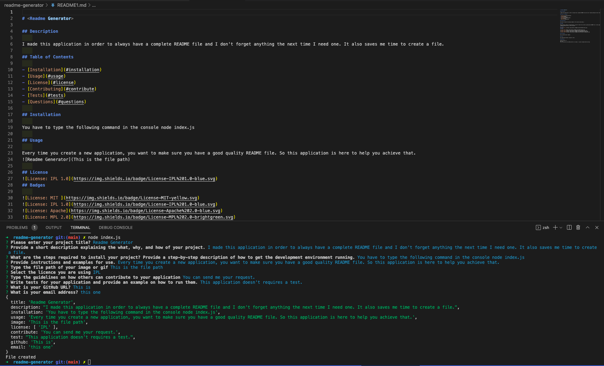

# <Readme Generator>

## Description
    
I made this application ir order to always have a complete README file and I don't forget anything the next time I need one. It also saves me time to create a file.
    
## Table of Contents
    
- [Installation](#installation)
- [Usage](#usage)
- [License](#license)
- [Contributing](#contribute)
- [Tests](#tests)
- [Questions](#questions)
    
## Installation
    
You have to type the following command in the terminal node index.js
    
## Usage
    
Every time you create a new application, you want to make sure you have a good quality README file. So this application is here to help you achieve that.

    
## License
[]
    
## Contribute
    
You can send me your request.
    
## Tests
    
This application doesn't requires any test.
    
## Questions
    
[https://github.com/salvadordiaz1222](https://github.com/salvadordiaz1222)
salvador.diaz1222@gmail.com
You can reach me at my GitHub profile or by email. I usually respond within one day.
    